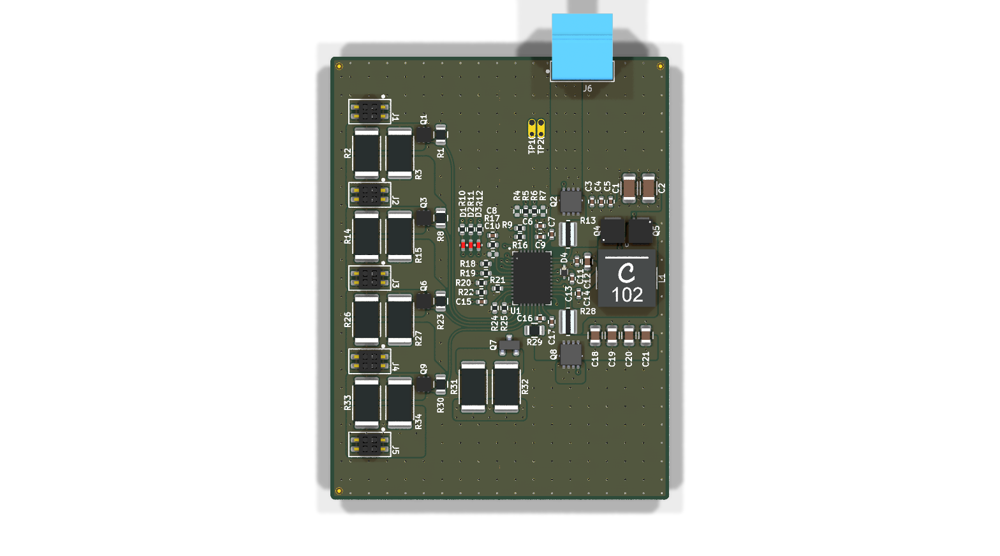
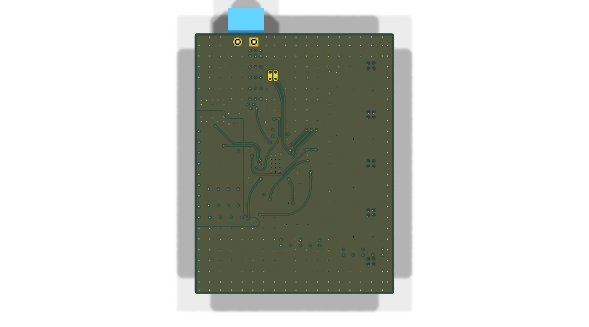
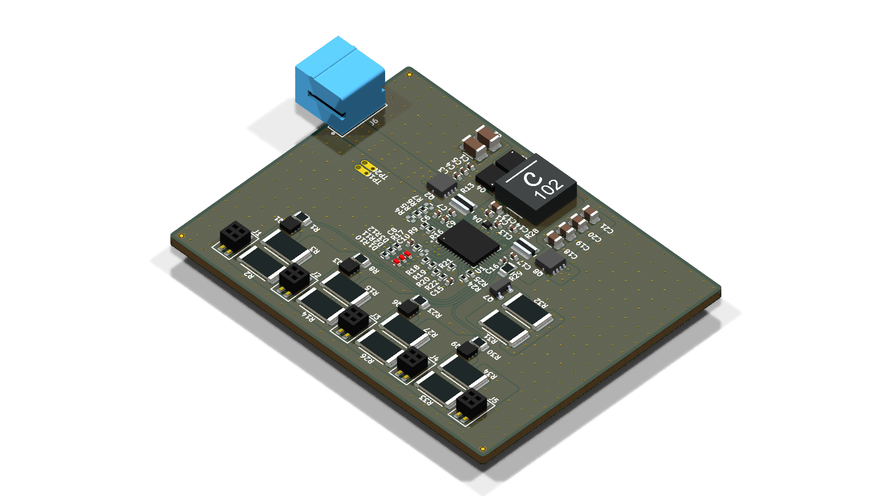
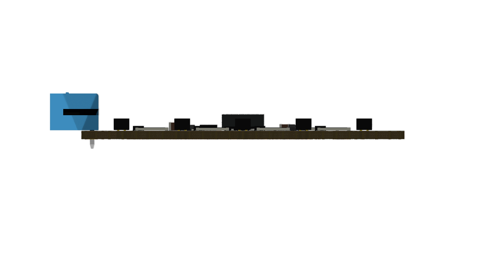
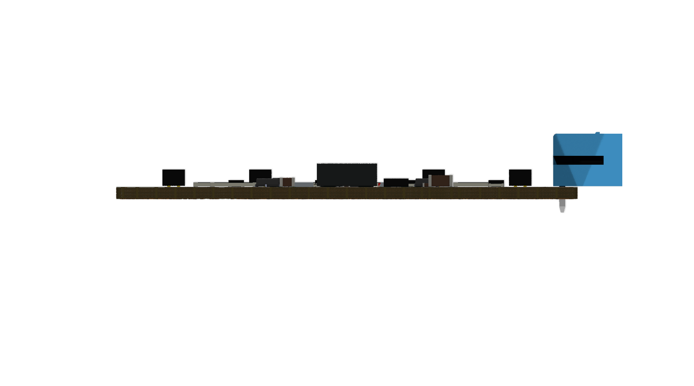

# Minimal_LTC3350

## Overview

This repository contains a minimal KiCad design project for the Analog Devices LTC3350, a high-current supercapacitor backup controller and system monitor. The project includes schematic designs and PCB layout files for implementing this versatile backup power solution.

## Disclaimer

> [!NOTE]
> This project is provided "as is" and without any warranty, express or implied. For more details, please see the [LICENSE](LICENSE) file.

## About the LTC3350

The LTC3350 from Analog Devices is a high-current supercapacitor backup controller and system monitor designed for high-reliability backup power applications. It integrates a synchronous step-down/step-up controller that charges and monitors a series stack of 1–4 supercapacitors.

Key features include:

- **High-Efficiency Power Conversion:**
  - Synchronous step-down CC/CV charging for 1–4 series supercapacitors
  - Step-up mode in backup for greater utilization of stored energy
  - Supports 10A+ charge and backup currents
- **Advanced Monitoring:**
  - 14-bit ADC for monitoring system voltages and currents
  - Capacitance and ESR monitoring
  - I²C/SMBus interface for reading monitored parameters
- **Protection Features:**
  - Active overvoltage protection shunts
  - Internal active balancers (no external balance resistors needed)
  - Dual ideal diode PowerPath™ controller with N-channel MOSFETs
- **Programmable Current Limit:** Prioritizes system load over capacitor charge current
- **Wide Operating Range:**
  - Input Voltage (VIN): 4.5V to 35V
  - Capacitor Voltage (VCAP): Up to 5V per capacitor
- **Package:** Available in a 38-lead QFN package (5mm × 7mm × 0.75mm) with exposed pad
- **Automotive Qualified:** AEC-Q100 qualified for automotive applications

## Project Structure

```
minimal_ltc3350/
├── minimal_ltc3350.kicad_pro                     # Project configuration file
├── minimal_ltc3350.kicad_sch                     # Main schematic file
├── minimal_ltc3350.kicad_pcb                     # PCB layout file
├── fp-lib-table                                  # Footprint library table
├── sym-lib-table                                 # Symbol library table
├── docs/                                         # Documentation files
│   ├── bom/                                      # Bill of Materials
│   │   └── minimal_ltc3350_ibom.html             # Interactive BOM file
│   ├── pictures/                                 # Images and photos
│   │   ├── 1_minimal_ltc3350_side.png            # Side view of PCB
│   │   ├── 2_minimal_ltc3350_top.png             # Top view of PCB
│   │   └── 3_minimal_ltc3350_bottom.png          # Bottom view of PCB
│   └── schematics/                               # Schematic PDF exports
│       └── minimal_ltc3350_schematics.pdf        # Complete schematics PDF
└── KiCAD_Symbols_Generator/                      # Submodule for symbol generation from CSV data
```

## Project Features

This design provides a minimal implementation of the LTC3350 with:

- Proper power supply connections for 4.5V to 35V input range
- Supercapacitor stack configuration (1–4 series capacitors)
- Active balancing circuitry
- I²C/SMBus communication interface
- Current sensing and monitoring
- Standard footprint for the 38-lead QFN package

## Getting Started

### Prerequisites

- [KiCad EDA](https://www.kicad.org/) version 9.0 or later installed on your system
- Git (for cloning the repository and submodule management)

### Opening the Project

1. **Clone the repository** (including submodules):
   ```bash
   git clone --recursive https://github.com/ionutms/Minimal_LTC3350.git
   ```

   If you've already cloned the repository without submodules, initialize them with:
   ```bash
   git submodule init
   git submodule update
   ```

2. **Open the project in KiCad**:
   - Launch KiCad
   - Click "Open Existing Project"
   - Navigate to the cloned repository folder
   - Select the `minimal_ltc3350.kicad_pro` file

3. **Explore the design**:
   - Open the schematic editor to view the circuit design
   - Open the PCB editor to view the board layout
   - Review the symbol and footprint libraries used in the design

### Project Files

- **Main schematic**: `minimal_ltc3350.kicad_sch` - Contains the primary circuit design with the LTC3350 and support components
- **PCB layout**: `minimal_ltc3350.kicad_pcb` - Physical board design file with proper component placement
- **Project configuration**: `minimal_ltc3350.kicad_pro` - KiCad project settings

## Dependencies

This project has the following dependencies:

### 1. KiCAD Symbols Generator

This repository uses [KiCAD_Symbols_Generator](https://github.com/ionutms/KiCAD_Symbols_Generator) as a submodule for custom symbol generation.

To initialize the submodule after cloning this repository:

```bash
git submodule update --init --recursive
```

### 2. 3D Models

This project requires the [3D_Models_Vault](https://github.com/ionutms/3D_Models_Vault) repository for 3D models.

#### Setup for KiCAD 9:

1. Clone the 3D models repository:
   ```bash
   git clone https://github.com/ionutms/3D_Models_Vault.git
   ```

2. In KiCAD 9, add an environment variable:
   - Variable name: `KICAD9_3D_MODELS_VAULT`
   - Variable value: Full path to where you cloned the 3D_Models_Vault repository

## Usage

After setting up the dependencies, open the project in KiCad 9 to access all features including the 3D models.

## Symbol Generator Submodule

This project includes the KiCAD_Symbols_Generator as a submodule, which provides tools for generating KiCad symbols from CSV data files. For more information on using this tool, see the [KiCAD_Symbols_Generator documentation](minimal_ltc3350/KiCAD_Symbols_Generator/README.md).

## Documentation

The `docs` folder contains:
- Schematic PDF exports
- Images and photos of the design

## Visuals

The following images showcase the PCB design from different perspectives:


*Top View of the PCB*


*Bottom View of the PCB*


*Side View of the PCB*


*Left View of the PCB*


*Right View of the PCB*


*Front View of the PCB*


*Back View of the PCB*

## License

This project is licensed under the MIT License - see the [LICENSE](LICENSE) file for details.

## References

- [LTC3350 Datasheet](https://www.analog.com/media/en/technical-documentation/data-sheets/ltc3350.pdf)
- [LTC3350 Product Page](https://www.analog.com/en/products/ltc3350.html)
- [KiCad EDA](https://www.kicad.org/)
